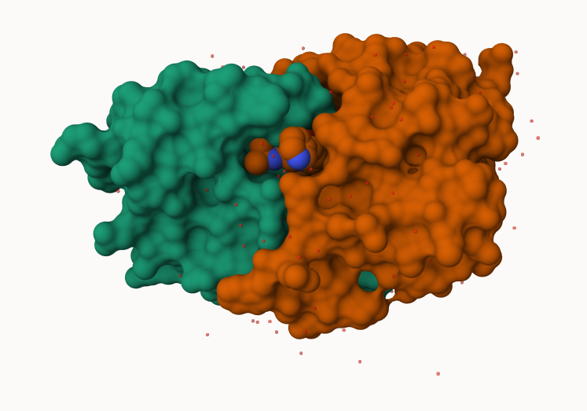
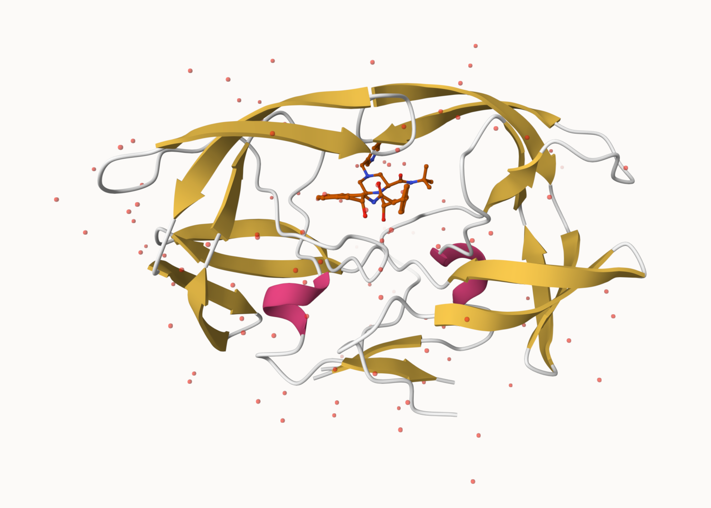
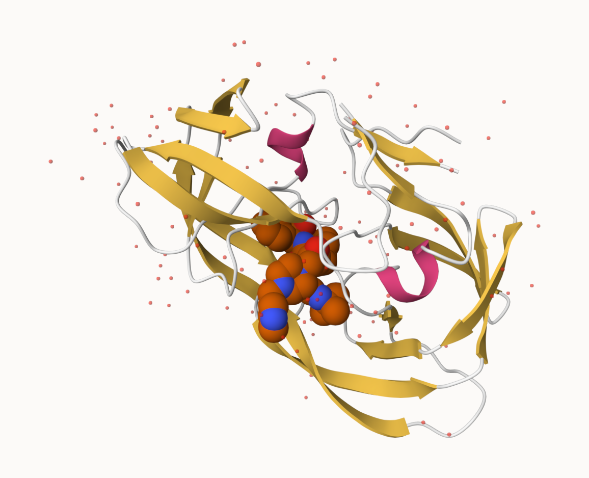
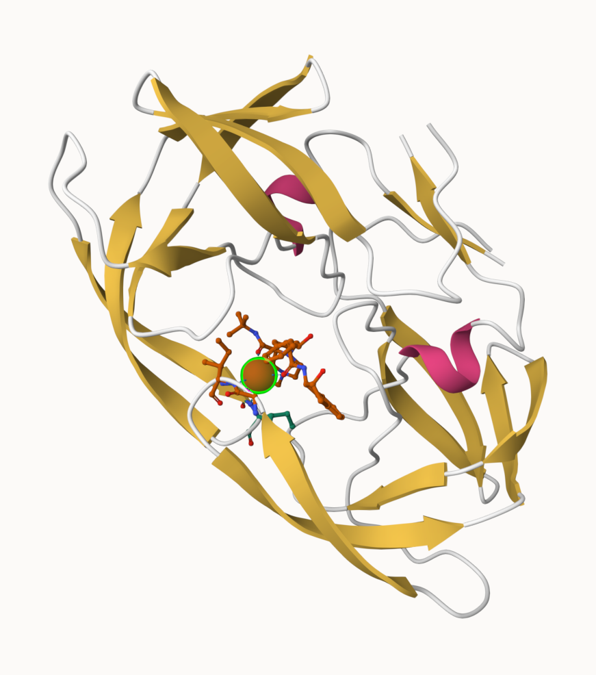

# Class 10: Structural Bioinformatics
Matthew Huang (A17978767)

## Introduction to the RCSB PDB

The [Protein Data Bank (PDB)](http://www.rcsb.org/) is the main
repository of biomolecular structure data. Let’s see what’s in it.

> Q1. What percentage of structures in the PDB are solved by X-Ray and
> Electron Microscopy?

Roughly 94%

> Q2. What proportion of structures in the PDB are proteins?

Roughly 86%

``` r
stats <- read.csv("pdbstats.csv", row.names = 1)
stats
```

                             X.ray    EM   NMR Integrative Multiple.methods Neutron
    Protein (only)          178795 21825 12773         343              226      84
    Protein/Oligosaccharide  10363  3564    34           8               11       1
    Protein/NA                9106  6335   287          24                7       0
    Nucleic acid (only)       3132   221  1566           3               15       3
    Other                      175    25    33           4                0       0
    Oligosaccharide (only)      11     0     6           0                1       0
                            Other  Total
    Protein (only)             32 214078
    Protein/Oligosaccharide     0  13981
    Protein/NA                  0  15759
    Nucleic acid (only)         1   4941
    Other                       0    237
    Oligosaccharide (only)      4     22

``` r
n.sums <- colSums(stats)
n <- n.sums/n.sums["Total"] 
round(n, digits=2)
```

               X.ray               EM              NMR      Integrative 
                0.81             0.13             0.06             0.00 
    Multiple.methods          Neutron            Other            Total 
                0.00             0.00             0.00             1.00 

> What’s the total number of entries in the PDB?

``` r
n.sums["Total"]
```

     Total 
    249018 

## Using Molstar

We can use the main [Molstar viewer
online](https://molstar.org/viewer/):



> Generate and insert an image of the HIV-Pr cartoon colored by
> secondary structure, showing the inhibitor (ligand) in ball and stick.



> Generate and insert an image of the HIV-Pr cartoon colored by
> secondary structure, showing the inhibitor (ligand) in spacefill.



> One final image showing catalytic APS 25 as ball and stick and the
> all-important active site water molecules as spacefill



## Bio3D package fpor structural bioinformatics

``` r
library(bio3d)
hiv <- read.pdb("1hsg")
```

      Note: Accessing on-line PDB file

``` r
hiv
```


     Call:  read.pdb(file = "1hsg")

       Total Models#: 1
         Total Atoms#: 1686,  XYZs#: 5058  Chains#: 2  (values: A B)

         Protein Atoms#: 1514  (residues/Calpha atoms#: 198)
         Nucleic acid Atoms#: 0  (residues/phosphate atoms#: 0)

         Non-protein/nucleic Atoms#: 172  (residues: 128)
         Non-protein/nucleic resid values: [ HOH (127), MK1 (1) ]

       Protein sequence:
          PQITLWQRPLVTIKIGGQLKEALLDTGADDTVLEEMSLPGRWKPKMIGGIGGFIKVRQYD
          QILIEICGHKAIGTVLVGPTPVNIIGRNLLTQIGCTLNFPQITLWQRPLVTIKIGGQLKE
          ALLDTGADDTVLEEMSLPGRWKPKMIGGIGGFIKVRQYDQILIEICGHKAIGTVLVGPTP
          VNIIGRNLLTQIGCTLNF

    + attr: atom, xyz, seqres, helix, sheet,
            calpha, remark, call

``` r
head(hiv$atom)
```

      type eleno elety  alt resid chain resno insert      x      y     z o     b
    1 ATOM     1     N <NA>   PRO     A     1   <NA> 29.361 39.686 5.862 1 38.10
    2 ATOM     2    CA <NA>   PRO     A     1   <NA> 30.307 38.663 5.319 1 40.62
    3 ATOM     3     C <NA>   PRO     A     1   <NA> 29.760 38.071 4.022 1 42.64
    4 ATOM     4     O <NA>   PRO     A     1   <NA> 28.600 38.302 3.676 1 43.40
    5 ATOM     5    CB <NA>   PRO     A     1   <NA> 30.508 37.541 6.342 1 37.87
    6 ATOM     6    CG <NA>   PRO     A     1   <NA> 29.296 37.591 7.162 1 38.40
      segid elesy charge
    1  <NA>     N   <NA>
    2  <NA>     C   <NA>
    3  <NA>     C   <NA>
    4  <NA>     O   <NA>
    5  <NA>     C   <NA>
    6  <NA>     C   <NA>

``` r
pdbseq(hiv)
```

      1   2   3   4   5   6   7   8   9  10  11  12  13  14  15  16  17  18  19  20 
    "P" "Q" "I" "T" "L" "W" "Q" "R" "P" "L" "V" "T" "I" "K" "I" "G" "G" "Q" "L" "K" 
     21  22  23  24  25  26  27  28  29  30  31  32  33  34  35  36  37  38  39  40 
    "E" "A" "L" "L" "D" "T" "G" "A" "D" "D" "T" "V" "L" "E" "E" "M" "S" "L" "P" "G" 
     41  42  43  44  45  46  47  48  49  50  51  52  53  54  55  56  57  58  59  60 
    "R" "W" "K" "P" "K" "M" "I" "G" "G" "I" "G" "G" "F" "I" "K" "V" "R" "Q" "Y" "D" 
     61  62  63  64  65  66  67  68  69  70  71  72  73  74  75  76  77  78  79  80 
    "Q" "I" "L" "I" "E" "I" "C" "G" "H" "K" "A" "I" "G" "T" "V" "L" "V" "G" "P" "T" 
     81  82  83  84  85  86  87  88  89  90  91  92  93  94  95  96  97  98  99   1 
    "P" "V" "N" "I" "I" "G" "R" "N" "L" "L" "T" "Q" "I" "G" "C" "T" "L" "N" "F" "P" 
      2   3   4   5   6   7   8   9  10  11  12  13  14  15  16  17  18  19  20  21 
    "Q" "I" "T" "L" "W" "Q" "R" "P" "L" "V" "T" "I" "K" "I" "G" "G" "Q" "L" "K" "E" 
     22  23  24  25  26  27  28  29  30  31  32  33  34  35  36  37  38  39  40  41 
    "A" "L" "L" "D" "T" "G" "A" "D" "D" "T" "V" "L" "E" "E" "M" "S" "L" "P" "G" "R" 
     42  43  44  45  46  47  48  49  50  51  52  53  54  55  56  57  58  59  60  61 
    "W" "K" "P" "K" "M" "I" "G" "G" "I" "G" "G" "F" "I" "K" "V" "R" "Q" "Y" "D" "Q" 
     62  63  64  65  66  67  68  69  70  71  72  73  74  75  76  77  78  79  80  81 
    "I" "L" "I" "E" "I" "C" "G" "H" "K" "A" "I" "G" "T" "V" "L" "V" "G" "P" "T" "P" 
     82  83  84  85  86  87  88  89  90  91  92  93  94  95  96  97  98  99 
    "V" "N" "I" "I" "G" "R" "N" "L" "L" "T" "Q" "I" "G" "C" "T" "L" "N" "F" 

Lets try out the new **bio3dview** package that is not yet on CRAN. We
can use the **remotes** package to install any R package from GitHub

## Quick viewing of PDB

``` r
#library(bio3dview)
#sele <- atom.select(hiv, resno=25)
#view.pdb(hiv, backgroundColor = "pink",
 #        highlight = sele,
  #       highlight.style = "spacefill")
```

## Prediction of Protein flexibility

``` r
adk <- read.pdb("6s36")
```

      Note: Accessing on-line PDB file
       PDB has ALT records, taking A only, rm.alt=TRUE

``` r
m <- nma(adk)
```

     Building Hessian...        Done in 0.019 seconds.
     Diagonalizing Hessian...   Done in 0.113 seconds.

``` r
plot(m)
```


Write out our results as a trajectory movie:

``` r
mktrj(m, file="results.pdb")
```

``` r
#view.nma(m)
```
