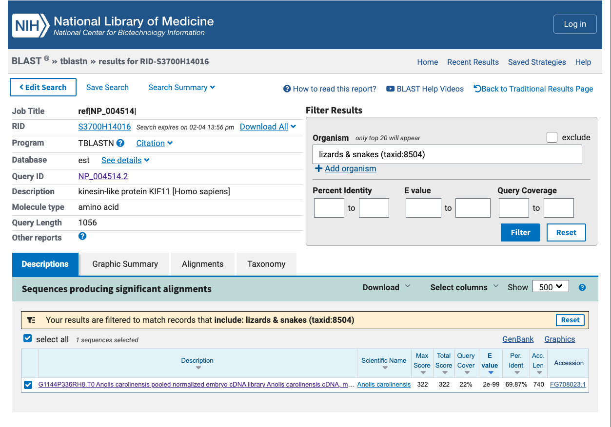
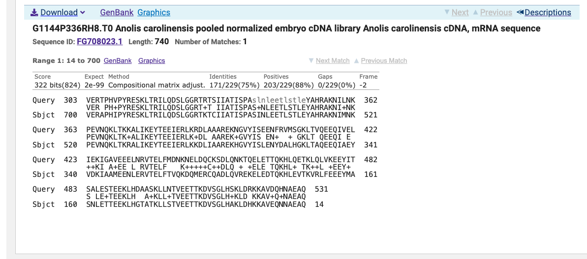
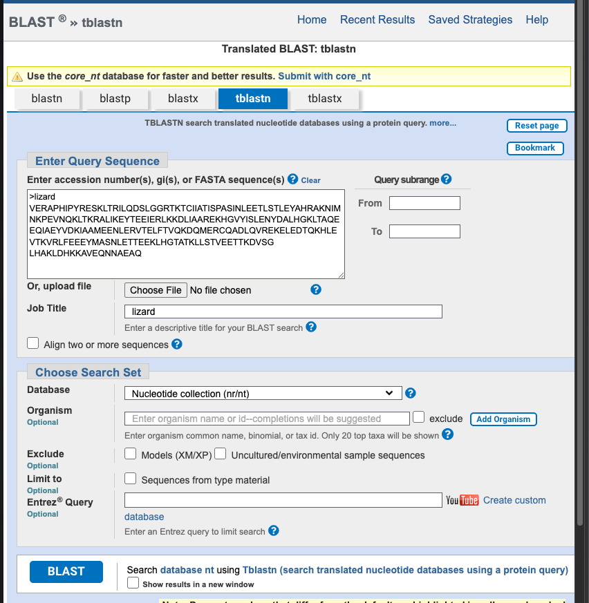

# Part 1:
## Q1. 

*Tell me the name of a protein you are interested in. Include the species, accession number and known function. This can be a human protein or a protein from any other species as long as it's function is known. *

Name: Kinesin Family Number 11 (KIF11)

Accession: NP_004514

Species: Homo Sapiens

Function: A motor protein required for the establishment of a bipolar mitotic spindle, thus facilitating chromosome congression during mitosis.


## Q2. 

*Perform a BLAST search against a DNA database, such as a database consisting of genomic DNA or ESTs. The BLAST server can be at NCBI or elsewhere. Include details of the BLAST method used, database searched and any limits applied (e.g. Organism).*

Method: tblastn search against ESTS

Database: Expressed Sequence Tags (est)

```{r}
#| echo: false
#| fig-cap: "tBLASTn setup for human KIF11 (NP_004514) against the NCBI EST nucleotide database"
#| out-width: "90%"

knitr::include_graphics("BlastSearch.png")
```

Chosen Match: Accession FG708023.1, a 740 base pair expressed sequence tag (EST) from an Anolis carolinensis embryo cDNA library. Alignment details are shown below.

```{r}
#| echo: false
#| fig-cap: "tBLASTn results summary showing a significant match between the human KIF11 protein (NP_004514) and an expressed sequence tag (FG708023.1) from *Anolis carolinensis* identified in the NCBI EST database."
#| out-width: "90%"


```

```{r}
#| echo: false
#| fig-cap: "Pairwise tBLASTn alignment between the human KIF11 protein (NP_004514) and the *Anolis carolinensis* EST FG708023.1, showing alignment score, E-value, and sequence similarity."
#| out-width: "90%"


```


## Q3. 

*Gather information about this “novel” protein. At a minimum, show me the protein sequence of the “novel” protein as displayed in your BLAST results from [Q2] as FASTA format (you can copy and paste the aligned sequence subject lines from your BLAST result page if necessary) or translate your novel DNA sequence using a tool called EMBOSS Transeq at the EBI. Don’t forget to translate all six reading frames; the ORF (open reading frame) is likely to be the longest sequence without a stop codon. It may not start with a methionine if you don’t have the complete coding region. Make sure the sequence you provide includes a header/subject line and is in traditional FASTA format. *

Chosen Sequence: 

>*Anolis Carolinensis*
VERAPHIPYRESKLTRILQDSLGGRTKTCIIATISPASINLEETLSTLEYAHRAKNIMNKPEVNQKLTKR
ALIKEYTEEIERLKKDLIAAREKHGVYISLENYDALHGKLTAQEEQIAEYVDKIAAMEENLERVTELFTV
QKDQMERCQADLQVREKELEDTQKHLEVTKVRLFEEEYMASNLETTEEKLHGTATKLLSTVEETTKDVSG
LHAKLDHKKAVEQNNAEAQ

Name: Putatative KF11-like Protein

Species: *Anolis Carolinesis*

Taxonomy: Eukaryota; Metazoa; Chordata; Craniata; Vertebrata; Tetrapoda;
Sauropsida; Lepidosauria; Squamata; Iguania; Dactyloidae; Anolis

## Q4. 

*Prove that this gene, and its corresponding protein, are novel. For the purposes of this project, “novel” is defined as follows. Take the protein sequence (your answer to [Q3]), and use it as a query in a blastp search of the nr database at NCBI. *

A tblastn search with a nr/nt database yielded a top hit result is to an Anolis Crolinesis protein with <100% percent identity. See attached screenshots for top hits and selected alignment details. 

```{r}
#| echo: false
#| fig-cap: "tBLASTn search setup using the translated 'lizard' protein query against the NCBI nucleotide collection (nt), used to search for matching coding regions in nucleotide sequences."
#| out-width: "95%"


```

```{r}
#| echo: false
#| fig-cap: "BLAST results used to assess novelty of the putative protein sequence: top database hits show high similarities with full query coverage but less than 100% amino-acid identity."
#| out-width: "95%"

knitr::include_graphics("novelproteinss.png")
```

