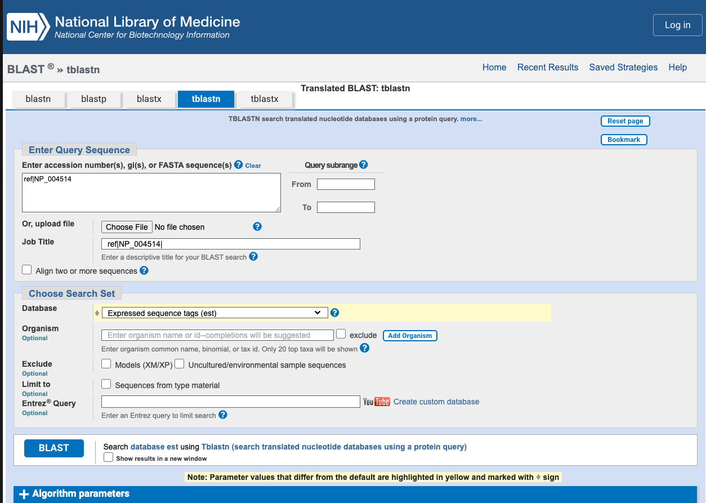
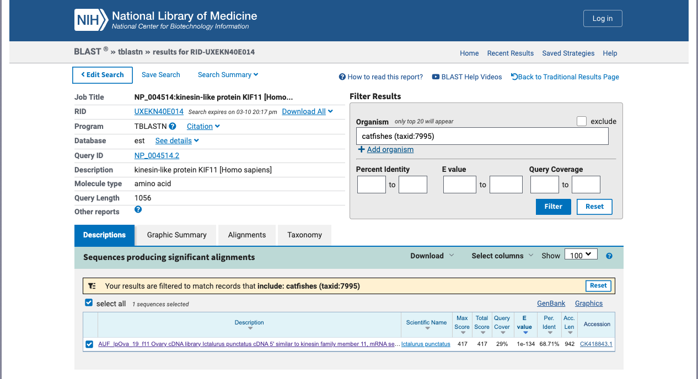
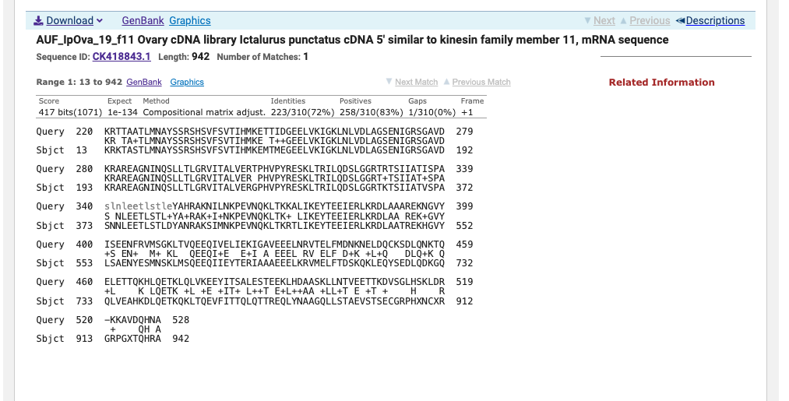
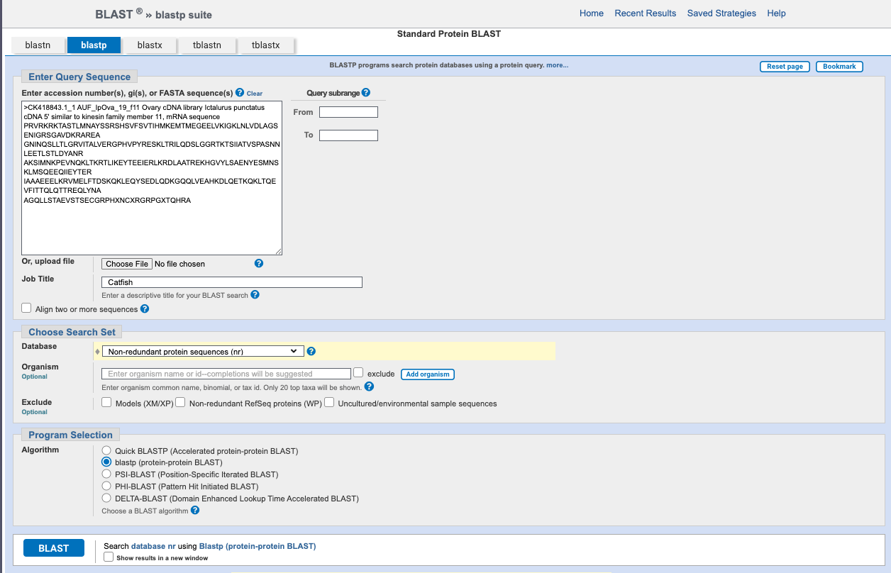
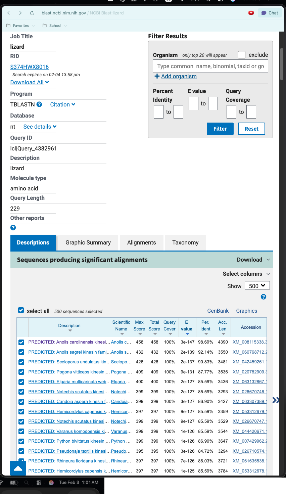
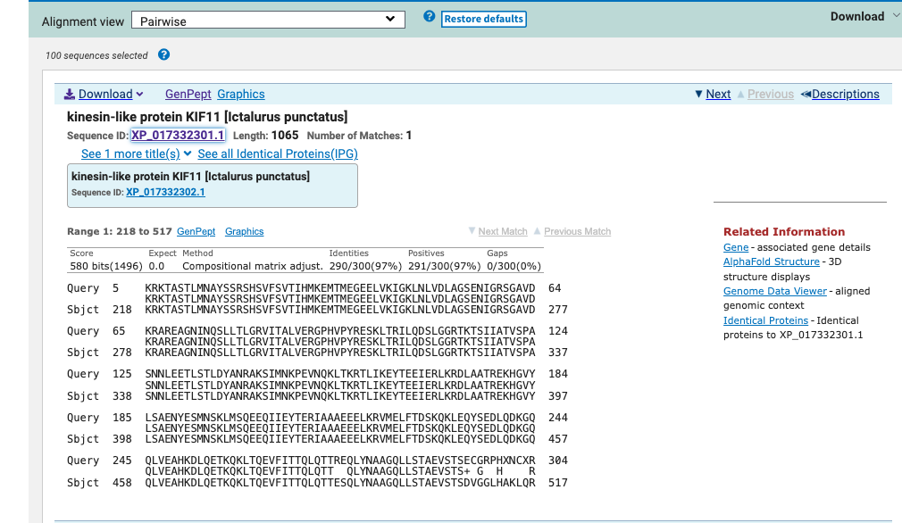
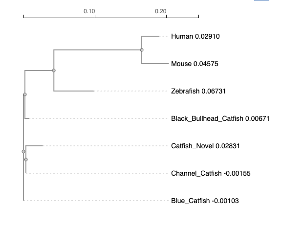
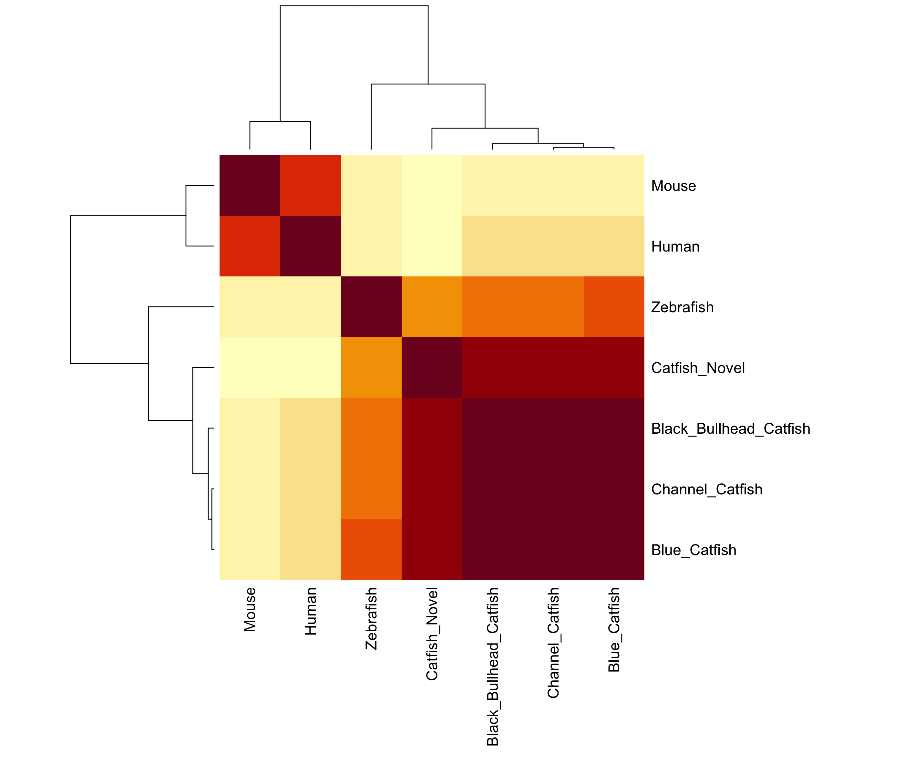
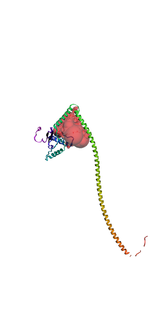

# Part 1:
## Q1. 

*Tell me the name of a protein you are interested in. Include the species, accession number and known function. This can be a human protein or a protein from any other species as long as it's function is known. *

Name: Kinesin Family Number 11 (KIF11)

Accession: NP_004514

Species: Homo Sapiens

Function: A motor protein required for the establishment of a bipolar mitotic spindle, thus facilitating chromosome congression during mitosis.


## Q2. 

*Perform a BLAST search against a DNA database, such as a database consisting of genomic DNA or ESTs. The BLAST server can be at NCBI or elsewhere. Include details of the BLAST method used, database searched and any limits applied (e.g. Organism).*

Method: tblastn search against ESTS

Database: Expressed Sequence Tags (est)

```{r}
#| echo: false
#| fig-cap: "tBLASTn setup for human KIF11 (NP_004514) against the NCBI EST nucleotide database"
#| out-width: "90%"


```


```{r}
#| echo: false
#| fig-cap: "tBLASTn results summary showing a significant match between the human KIF11 protein (NP_004514) and an expressed sequence tag (CK418843.1) from *Ictalurus punctatus* identified in the NCBI EST database."
#| out-width: "90%"


```

```{r}
#| echo: false
#| fig-cap: "Pairwise tBLASTn alignment between the human KIF11 protein (NP_004514) and the *Ictalurus Punctatus* EST FG708023.1, showing alignment score, E-value, and sequence similarity."
#| out-width: "90%"


```


## Q3. 

*Gather information about this “novel” protein. At a minimum, show me the protein sequence of the “novel” protein as displayed in your BLAST results from [Q2] as FASTA format (you can copy and paste the aligned sequence subject lines from your BLAST result page if necessary) or translate your novel DNA sequence using a tool called EMBOSS Transeq at the EBI. Don’t forget to translate all six reading frames; the ORF (open reading frame) is likely to be the longest sequence without a stop codon. It may not start with a methionine if you don’t have the complete coding region. Make sure the sequence you provide includes a header/subject line and is in traditional FASTA format. *

Chosen Sequence: 

*>Ictalurus_Punctatus 
PRVRKRKTASTLMNAYSSRSHSVFSVTIHMKEMTMEGEELVKIGKLNLVDLAGSENIGRS
GAVDKRAREAGNINQSLLTLGRVITALVERGPHVPYRESKLTRILQDSLGGRTKTSIIAT
VSPASNNLEETLSTLDYANRAKSIMNKPEVNQKLTKRTLIKEYTEEIERLKRDLAATREK
HGVYLSAENYESMNSKLMSQEEQIIEYTERIAAAEEELKRVMELFTDSKQKLEQYSEDLQ
DKGQQLVEAHKDLQETKQKLTQEVFITTQLQTTREQLYNAAGQLLSTAEVSTSECGRPHX
NCXRGRPGXTQHRA*

Name: Putative KIF11-like Protein

Species: *Ictalurus Punctatus *


## Q4. 

*Prove that this gene, and its corresponding protein, are novel. For the purposes of this project, “novel” is defined as follows. Take the protein sequence (your answer to [Q3]), and use it as a query in a blastp search of the nr database at NCBI. *

A blastp search with a nr database yielded a top hit result is to an Anolis Crolinesis protein with <100% percent identity. See attached screenshots for top hits and selected alignment details. 

```{r}
#| echo: false
#| fig-cap: "NCBI blastp search setup for the translated catfish candidate protein derived from EST accession CK418843.1, queried against the non-redundant protein sequence (nr) database to assess whether the predicted protein is novel."
#| out-width: "95%"


```

```{r}
#| echo: false
#| fig-cap: "blastp results summary for the translated protein from CK418843.1 against the NCBI nr database. The top matches are KIF11-family proteins from catfish and related teleost species; the best hit to Ictalurus punctatus shows 96.67% amino-acid identity with 96% query coverage and E-value = 0.0, supporting homology to KIF11 while remaining below the project’s 100% same-species cutoff for a non-novel sequence"
#| out-width: "95%"


```

```{r}
#| echo: false
#| fig-cap: "Top blastp pairwise alignment of the novel catfish protein against kinesin-like protein KIF11 from *Ictalurus punctatus* (XP_017332301.1). The alignment shows 97% identity, 97% positives, 0 gaps, and an E-value of 0.0, indicating the sequence is highly similar but not identical and is consistent with a novel KIF11-like gene."
#| out-width: "95%"


```
# Part 2: 


## Q5. 

*Generate a multiple sequence alignment with your novel protein, your original
query protein, and a group of other members of this family from different species.*

Re-labeled sequences for alignment

```{r}
#| echo: false
#| warning: false
#| message: false
#| results: asis

aln_lines <- readLines("q5_kif11_raw.fasta", warn = FALSE)

cat(
  "<pre style='font-family: Courier, monospace; font-size: 7pt; line-height: 1.1;'>",
  paste(aln_lines, collapse = "\n"),
  "</pre>",
  sep = ""
)
```


### Alignment


```{r}
aln_lines <- readLines("MUSCLE Alignment.aln-clustalw")

cat(
  "<pre style='font-family: Courier, monospace; font-size: 7pt; line-height: 1.1;'>",
  paste(aln_lines, collapse = "\n"),
  "</pre>",
  sep = ""
)
```


## Q6. 

*Create a phylogenetic tree, using either a parsimony or distance-based approach.*

```{r}
#| echo: false
#| fig-cap: "Phylogenetic tree generated from the trimmed KIF11-family multiple sequence alignment using EBI Simple Phylogeny (neighbour-joining), illustrating clustering of the novel catfish sequence with other fish KIF11 homologs."
#| out-width: "90%"


```

The tree shows the expected clustering pattern for homologous KIF11 sequences, with the novel catfish protein grouping with catfish/fish homologs rather than with the mammalian sequences.


## Q7. 

*Generate a sequence identity based heatmap of your aligned sequences using R. *

```{r echo=FALSE, warning=FALSE, message=FALSE, results='hide'}
library(bio3d)

lines <- readLines("MUSCLE Alignment.aln-clustalw")

lines <- lines[nzchar(trimws(lines))]
lines <- lines[!grepl("^CLUSTAL", lines)]
lines <- lines[!grepl("^[[:space:][:punct:]]+$", lines)]

parts <- strsplit(lines, "[[:space:]]+")
parts <- lapply(parts, function(x) x[x != ""])

parts <- parts[sapply(parts, length) >= 2]

nm <- sapply(parts, `[`, 1)
frag <- sapply(parts, `[`, 2)

seqs <- tapply(frag, nm, paste0, collapse = "")

out <- unlist(Map(function(name, seq) c(paste0(">", name), seq),
                  names(seqs), seqs))

writeLines(out, "q7_trimmed_alignment.fasta")

aln <- read.fasta("q7_trimmed_alignment.fasta")
id.mat <- seqidentity(aln)

png("Q7_heatmap.png", width = 2800, height = 2400, res = 260)
par(mar = c(14, 14, 4, 2))

heatmap(
  id.mat,
  symm = TRUE,
  margins = c(14, 14),
  cexRow = 1.3,
  cexCol = 1.3
)

dev.off()
```


{width=95%}


## Q8. 

*Using R/Bio3D (or an online blast server if you prefer), search the main protein
structure database for the most similar atomic resolution structures to your aligned
sequences. List the top 3 unique hits (i.e. not hits representing different chains from the same
structure) along with their Evalue and sequence identity to your query. Please also add
annotation details of these structures. For example include the annotation terms PDB
identifier (structureId), Method used to solve the structure (experimentalTechnique),
resolution (resolution), and source organism (source).*

```{r echo=FALSE, warning=FALSE, message=FALSE, results='asis'}
library(bio3d)
library(knitr)

aln <- read.fasta("q7_trimmed_alignment.fasta")

target_name <- "Channel_Catfish"
i <- match(target_name, aln$id)

if (is.na(i)) {
  stop("Could not find Channel_Catfish in aln$id")
}

query_seq <- paste(aln$ali[i, ], collapse = "")
query_seq <- gsub("-", "", query_seq)

query_seq_short <- substr(query_seq, 1, min(300, nchar(query_seq)))

bl <- blast.pdb(query_seq_short)

bl$hit$structureId <- sub("_.*$", "", bl$hit$pdb.id)

ann <- pdb.annotate(unique(bl$hit$structureId))

hit_tab <- merge(
  bl$hit,
  ann,
  by.x = "structureId",
  by.y = "structureId",
  all.x = TRUE
)

hit_tab <- hit_tab[!is.na(hit_tab$source) & hit_tab$source != "", ]

hit_tab_unique_species <- hit_tab[!duplicated(hit_tab$source), ]

top_hits <- head(hit_tab_unique_species, 3)

if (nrow(top_hits) < 3) {
  stop("Fewer than 3 unique species were found in the BLAST-PDB results.")
}

q8_table <- data.frame(
  PDB_ID = top_hits$structureId,
  `E-value` = format(top_hits$evalue, scientific = TRUE),
  Identity = top_hits$identity,
  Method = top_hits$experimentalTechnique,
  Resolution = top_hits$resolution,
  Source = top_hits$source,
  stringsAsFactors = FALSE
)

kable(
  q8_table,
  align = "lrrlll",
  booktabs = TRUE,
  caption = "Top 3 PDB structure hits for the Channel Catfish KIF11 query fragment from three different source species."
)

```
The PDB database was searched using a representative 300-amino-acid Channel_catfish KIF11 aligned sequence fragment with Bio3D blast.pdb(), and the top 3 unique structure hits were annotated using pdb.annotate()

The top structural matches were kinesin-family proteins solved by X-ray crystallography from *Homo sapiens*, consistent with the query sequence belonging to the conserved KIF11 motor protein family.

## Q9.

A structural model of the novel catfish KIF11-like protein was generated using AlphaFold with default parameters. The model was visualized in Mol*, where the protein was displayed as a cartoon colored by uncertainty score and conserved residues identified from the multiple sequence alignment were highlighted as spacefill. They were made a little opaque and smaller in order to be able to better visualize the protein, as the structure is somewhat compact.

.png){width=120%}


## Q10. 

*Provide an image or
screen-shot of your largest predicted pockets “negative volume” and provide it’s area
and volume. Are there any Target Associated Assays and ligand efficiency data
reported that may be useful starting points for exploring potential inhibition of your novel
protein? Briefly discuss (100 words max) the druggability of your novel protein based on:
- Presence of well-defined pockets (output of tools like CASTpFold),
- Existence of known inhibitors for related proteins (your search of ChEMBEL),
- Conservation of binding sites across homologs (your conservation analysis in Q10),
- Potential therapeutic applications if this protein were targeted (you can use ChatGPT,
Claude etc. backed up by your reading of the literature here).*

### i. 

The AlphaFold structure of the novel catfish KIF11-like protein was analyzed with CASTpFold to identify potential ligand-binding pockets. The largest predicted pocket is shown below. The corresponding pocket area was 1529.785 \ \text{\AA}^2 and the pocket volume was 6314.739 \ \text{\AA}^3.

{width=50%}


### ii. 

A ChEMBL Target search identified CHEMBL4581 (kinesin-like protein KIF11) as a relevant target entry for the KIF11 family. The target record includes associated assays, with 184 assays listed and most classified as binding assays, as well as ligand efficiency data shown in the ligand-efficiency plot. In addition, the target page lists inhibitory compounds and clinical candidates such as ispinesib, litronesib, and filanesib. Together, these results indicate that related KIF11-family proteins have substantial assay coverage and known small-molecule inhibitors that could inform exploration of inhibition of the novel catfish KIF11-like protein.


### iii. 

The novel catfish KIF11-like protein appears potentially druggable because CASTpFold identified a well-defined pocket with an area of 1529.785\ \text{\AA}^2 and a volume of 6314.739\ \text{\AA}^3. ChEMBL data for the related KIF11 target show associated assays, ligand-efficiency data, and known inhibitory compounds such as ispinesib, litronesib, and filanesib, supporting chemical tractability of this protein family. In addition, the aligned region is strongly conserved across homologs, suggesting functional importance of the binding region. Because KIF11-family proteins are involved in mitotic spindle formation, inhibitors targeting this site could have therapeutic relevance in controlling abnormal cell proliferation.