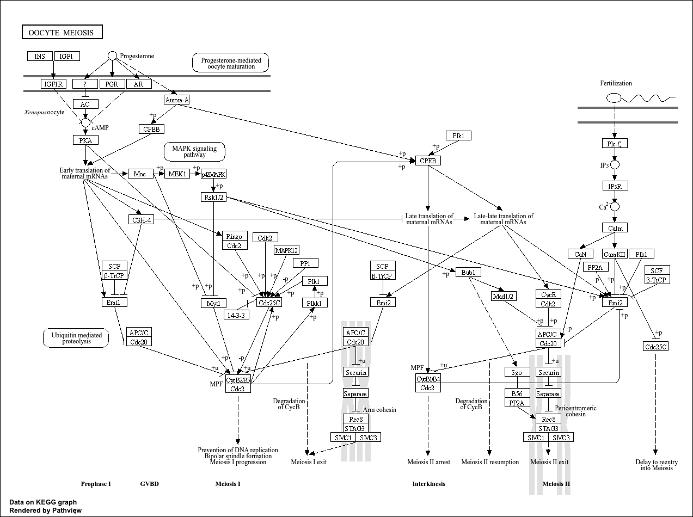
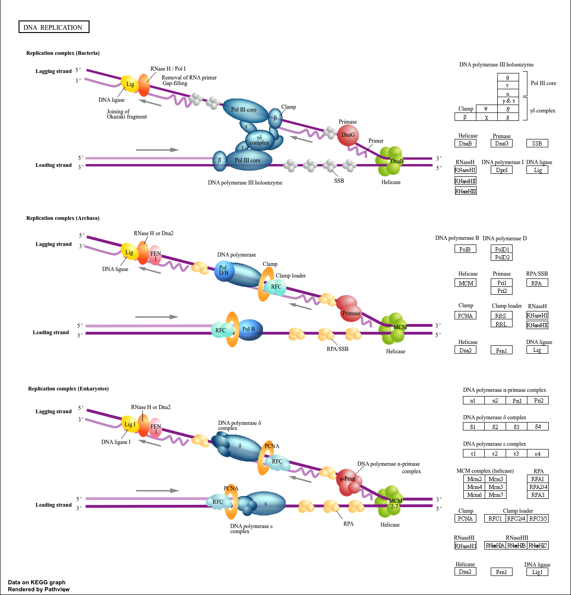
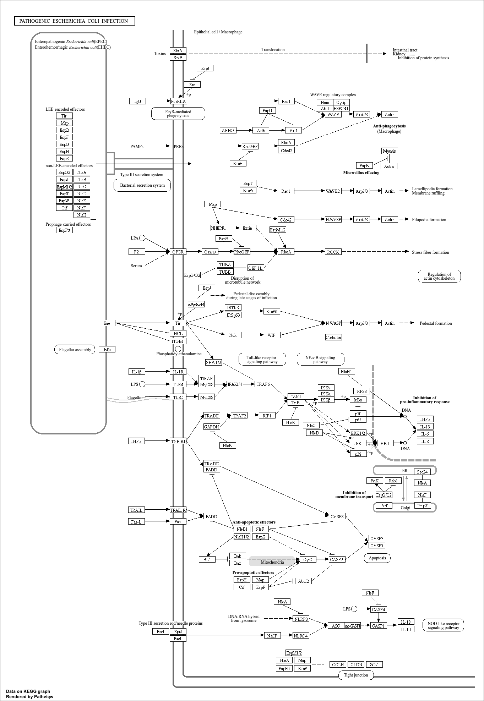
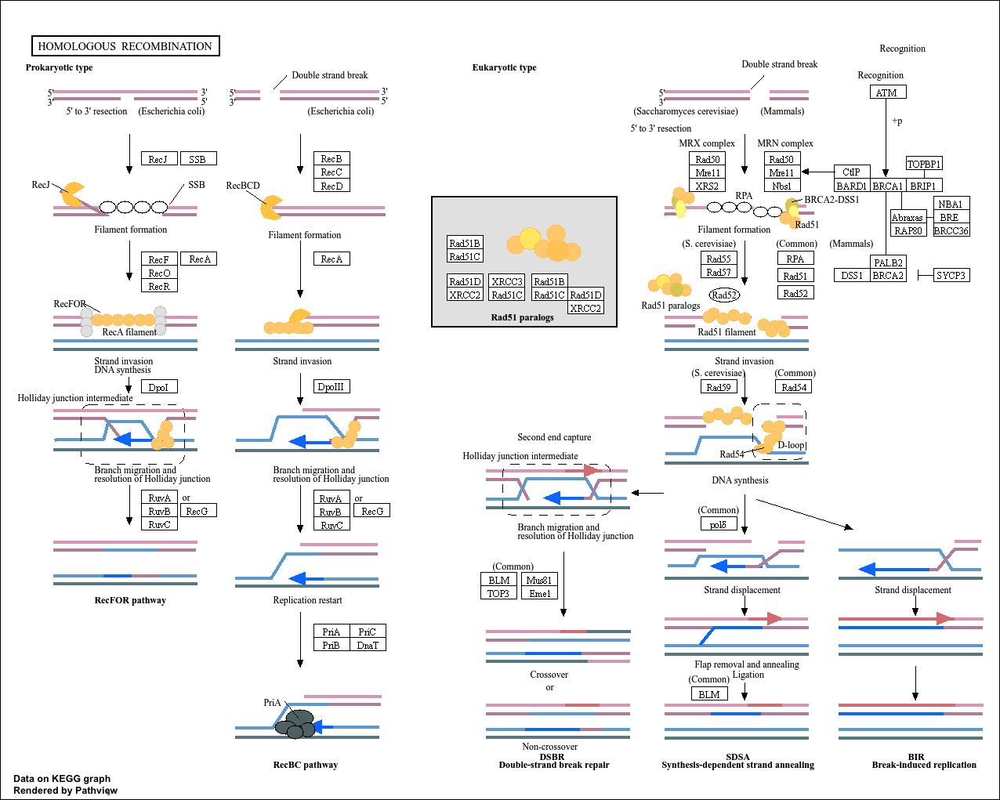

## Background

The data for today's mini-project comes from a knock-down study of an important Hox gene

## Data Import

```{r}
countFile <- "GSE37704_featurecounts.csv"
metaFile  <- "GSE37704_metadata.csv"

countData <- read.csv(countFile, row.names = 1)
colData   <- read.csv(metaFile,  row.names = 1)
```

### Cleanup (data tidying)

```{r}
countData <- countData[, -1]

to.keep <- rowSums(countData) > 10

countData <- countData[to.keep, ]
```

We need to remove the length column from our `countData` to make the columns match the rows in `colData`
```{r}
head(countData)
head(colData)

ncol(countData) == nrow(colData)
```

## DESeq Analysis

```{r, message=F}
library(DESeq2)
```

### Setting up the input object
```{r}
dds <- DESeqDataSetFromMatrix(
  countData = countData,
  colData   = colData,
  design    = ~ condition
)
```

### Running DESeq 
```{r}
dds <- DESeq(dds)
```

### Getting results
```{r}
res <- results(dds)
head(res)

write.csv(res, "results.csv")
```

## Volcano Plot

```{r}
library(ggplot2)

res_df <- as.data.frame(res)
res_df <- res_df[!is.na(res_df$padj), , drop = FALSE]

ggplot(res_df, aes(x = log2FoldChange, y = -log10(padj))) +
  geom_point(alpha = 0.6) +
  geom_vline(xintercept = c(-2, 2)) +
  geom_hline(yintercept = -log10(0.05)) +
  labs(
    title = "Hox gene knockdown: differential expression",
    x = "Log2 fold change",
    y = "-Log10 adjusted p-value"
  ) +
  theme_minimal()
```

```{r}
res_df$group <- "not_sig"
res_df$group[res_df$padj < 0.05 & res_df$log2FoldChange >  2] <- "up"
res_df$group[res_df$padj < 0.05 & res_df$log2FoldChange < -2] <- "down"

ggplot(res_df, aes(x = log2FoldChange, y = -log10(padj), color = group)) +
  geom_point(alpha = 0.7) +
  geom_vline(xintercept = c(-2, 2)) +
  geom_hline(yintercept = -log10(0.05)) +
  labs(
    title = "Hox gene knockdown: volcano plot",
    x = "Log2 fold change",
    y = "-Log10 adjusted p-value"
  ) +
  theme_minimal()
```
## Add Annotation (gene symbols and entrez ids)

```{r}
library(AnnotationDbi)
library(org.Hs.eg.db)
```

```{r}
columns(org.Hs.eg.db)

res$symbol <- mapIds(org.Hs.eg.db,
                    keys = rownames(res), # ids
                    keytype = "ENSEMBL",# format
                    column = "SYMBOL") # translating to

res$entrez <- mapIds(org.Hs.eg.db,
                    keys = rownames(res), # ids
                    keytype = "ENSEMBL",# format
                    column = "ENTREZID") # translating to

res$name <- mapIds(org.Hs.eg.db,
                    keys = rownames(res), # ids
                    keytype = "ENSEMBL",# format
                    column = "GENENAME") # translating to

res = res[order(res$pvalue),]
write.csv(res, file="deseq_results.csv")

head(res)
```

## Pathway Analysis

```{r, message=F}
library(gage)
library(gageData)
library(pathview)
```

```{r}
foldchanges <- res$log2FoldChange
names(foldchanges) <- res$symbol
head(foldchanges)
```

### KEGG
```{r, message=FALSE}
data(kegg.sets.hs)

keggres <- gage(foldchanges, gsets = kegg.sets.hs)
head(keggres$less, 5)
```

```{r}
pathview(gene.data = foldchanges, pathway.id = "hsa04110")
pathview(gene.data = foldchanges, pathway.id = "hsa04114")
pathview(gene.data = foldchanges, pathway.id = "hsa03030")
pathview(gene.data = foldchanges, pathway.id = "hsa05130")
pathview(gene.data = foldchanges, pathway.id = "hsa03440")
```







### GO

```{r}
data(go.sets.hs)
data(go.subs.hs)

gobpsets <- go.sets.hs[go.subs.hs$BP]
gobpres  <- gage(foldchanges, gsets = gobpsets)

head(gobpres$less)
```

### Reactome
```{r}
sig_genes <- res[!is.na(res$padj) & res$padj <= 0.05, "symbol"]
sig_genes <- sig_genes[!is.na(sig_genes)]

cat("Total number of significant genes:", length(sig_genes), "\n")

write.table(
  sig_genes,
  file = "significant_genes.txt",
  row.names = FALSE,
  col.names = FALSE,
  quote = FALSE
)
```

> Q: What pathway has the most significant “Entities p-value”? Do the most significant pathways listed match your previous KEGG results? What factors could cause differences between the two methods?

Cell Cycle (Mitotic) was the most significant pathway. Overall, the most significant pathways largely align with the earlier KEGG results. Differences between the two methods likely come from how each database organizes and defines pathways. KEGG tends to group processes more broadly, like listing the cell cycle as a single pathway, while Reactome breaks the same biological processes into multiple, more specific and detailed pathways.

